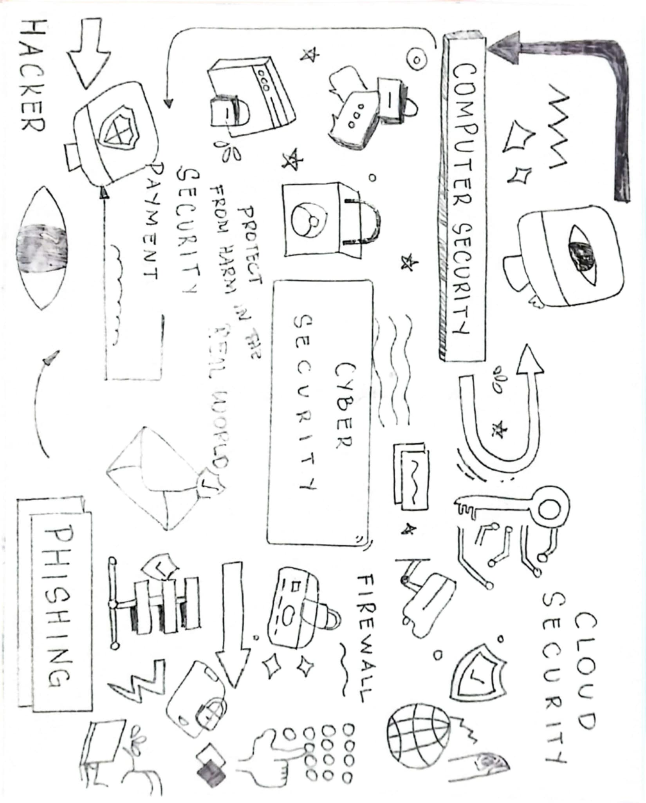
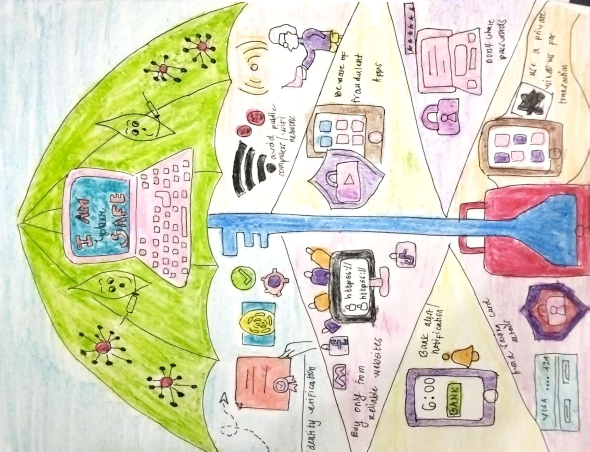
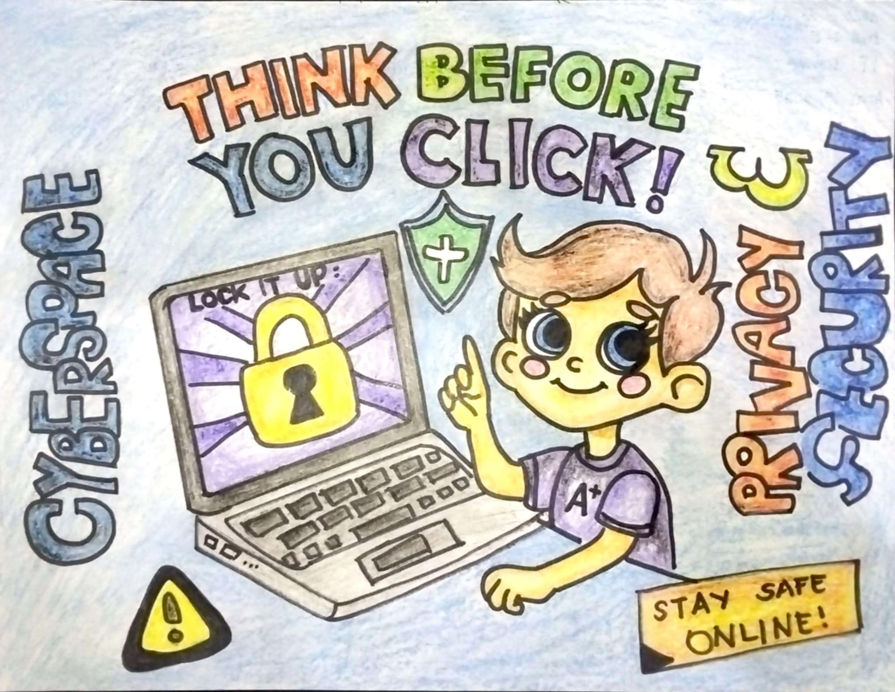
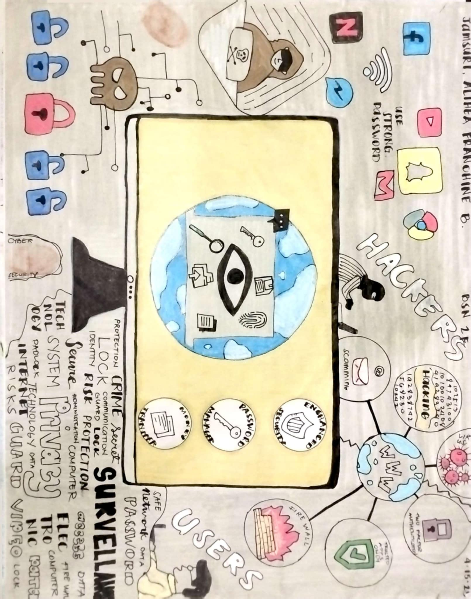

# Gemma 3-4B Model Evaluation

## Overview
This document contains evaluations of student artwork and accompanying narratives related to cybersecurity themes using the Gemma 3-4B model.

## Evaluation Scale
- A (90-100): Excellent
- B (80-89): Good
- C (70-79): Satisfactory
- D (60-69): Needs Improvement
- F (below 60): Unsatisfactory

## Evaluation Criteria
- Creativity
- Theme Relevance
- Technical Quality
- Narrative Explanation

## Student Artwork 1

### Model Response
The artwork consists of a very basic, almost rudimentary, drawing of a skull overlaid with a digital-looking circuit board.

#### Evaluation & Scoring
**Overall Score: C (70-79)**

- **Creativity (7/10)**: The concept of using a skull and circuit board to represent cyberbullying is somewhat creative and conceptually linked to the theme. However, the execution is not particularly inventive.
- **Theme Relevance (8/10)**: The artwork and narrative clearly relate to the theme of cyberbullying. The symbolism (skull for pain, circuit board for technology) directly addresses the topic.
- **Technical Quality (6/10)**: The technical quality is weak. It's a functional representation of the concept, but doesn't demonstrate strong artistic skill.
- **Narrative Explanation (7/10)**: The explanation is clear and directly relates the visual elements to the theme. It's a straightforward and understandable articulation of the artwork's intent.

*The skull represents the pain and mental anguish of online cyberbullying. The circuit board represents the digital systems that support it.*

## Student Artwork 2

### Model Response
The artwork depicts a vibrant, somewhat chaotic scene featuring a large, stylized tree. The tree's branches are adorned with various digital devices (smartphones, tablets, laptops) and glowing screens. There are also bubbles floating around the devices, some with question marks.

#### Evaluation & Scoring
**Overall Score: B (80-89)**

- **Creativity (7/10)**: The use of the tree as a metaphor for growth combined with technology is quite creative. It's a strong visual representation of a common theme. The floating bubbles with question marks are also an effective addition.
- **Theme Relevance (9/10)**: The artwork and narrative directly address the theme of technology's impact on growth and well-being. The symbolism (tree = growth, screens = technology) is exceptionally well-aligned with the theme.
- **Technical Quality (8/10)**: The technical quality is very good – a solid and pleasing illustration.
- **Narrative Explanation (8/10)**: The explanation is clear, concise, and powerfully connects the visual elements to the theme. It effectively explains the artist's intention.

*The tree represents growth, but the screens show the technology that can also hinder it.*

## Student Artwork 3

### Model Response
The artwork features a young student character holding a laptop with a prominent padlock superimposed over it. The character is smiling and appears engaged with the device. There's a background suggesting a classroom setting.

#### Evaluation & Scoring
**Overall Score: A (90-100)**

- **Creativity (9/10)**: The use of the student character and the direct message is highly creative and effective. It's a simple yet powerful way to convey the theme of cybersecurity.
- **Theme Relevance (10/10)**: The artwork and narrative directly address the theme of cybersecurity. The visuals (laptop, padlock) and the message are perfectly aligned.
- **Technical Quality (9/10)**: The artwork demonstrates excellent technical skill – well-executed with attention to detail.
- **Narrative Explanation (10/10)**: The explanation is concise, clear, and actionable. It provides a practical tip related to cybersecurity.

*Protect your data! Always use a strong password.*

## Student Artwork 4

### Model Response
The artwork depicts a stylized lock and key intertwined with a swirling vortex or cyclone. The colors are predominantly blues and purples, giving it an energetic, somewhat chaotic feel. There are fragmented computer screens and lines suggesting data streams within the vortex.

#### Evaluation & Scoring
**Overall Score: C (70-79)**

- **Creativity (6/10)**: The use of the vortex as a visual metaphor for cyber threats is somewhat imaginative, but it's not entirely novel. The fragmented computer screens add some complexity, but it's a relatively straightforward representation of the concept.
- **Theme Relevance (8/10)**: The artwork and narrative directly address the theme of cybersecurity. The visual of a vortex (representing chaos) and the message are well-aligned.
- **Technical Quality (7/10)**: The technical quality is solid, with a good balance between complexity and clarity.
- **Narrative Explanation (7/10)**: The explanation is concise and informative, but it could benefit from a slightly more evocative tone.

*Protect your data from cyber threats!*

## Student Artwork 5

### Model Response
The artwork features a stylized silhouette of a young person with a determined expression, holding a smartphone. Overlaid on the smartphone is a prominent shield icon, and swirling data streams emanate from it. The background is a dark, abstract gradient suggesting a digital landscape.

#### Evaluation & Scoring
**Overall Score: B (80-89)**

- **Creativity (8/10)**: The imagery is quite effective – the silhouette immediately suggests a user, and the swirling data streams represent the constant flow of information that needs protection. The overall concept is well-executed and relatable.
- **Theme Relevance (9/10)**: The artwork and narrative strongly align with the theme of cybersecurity. The focus on protecting personal information is clear and pertinent.
- **Technical Quality (8/10)**: The artwork is technically very solid – the use of color, composition, and detail is all well-executed, enhancing the impact of the message.
- **Narrative Explanation (8/10)**: The narrative is concise, impactful, and immediately understandable. It's a strong call to action.

*Protect your digital life.*
